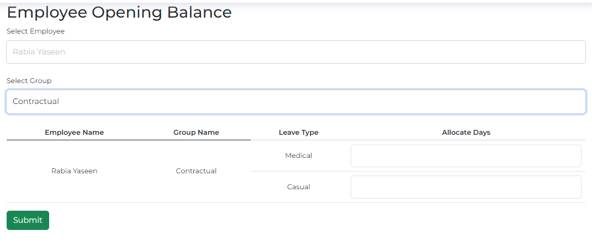

# Teacher Leave Management System


A simple leave management system designed for school teachers to efficiently manage and request leaves.

## Table of Contents

- [Features](#features)
- [Installation](#installation)
- [Database Setup](#database-setup)
- [Contributing](#contributing)
- [License](#license)
- [Contact](#contact)

## Features

- Teacher leave requests and approvals
- Real-time leave status tracking
- Email notifications for leave approvals
- User authentication and authorization

## Installation

Follow these steps to set up the Teacher Leave Management System locally:

1. Clone the repository:

    ```bash
    git clone https://github.com/your-username/teacher-leave-system.git
    ```

2. Navigate to the project directory:

    ```bash
    cd teacher-leave-system
    ```

3. **Database Setup:**

   - Create a SQL Server database for the Teacher Leave Management System.
   - Update the connection string in the `appsettings.json` file with your database details.

4. **Apply Migrations:**

    ```bash
    dotnet ef database update
    ```

5. **Install Dependencies:**

    ```bash
    dotnet restore
    ```

6. **Run the Application:**

    ```bash
    dotnet run
    ```


## Database Setup

Make sure to create a SQL Server database for the Teacher Leave Management System and update the connection string in the `appsettings.json` file with your database details.





## Contributing

We welcome contributions! If you would like to contribute to the project, follow these steps:

1. Fork the project.
2. Create your feature branch:

    ```bash
    git checkout -b feature/your-feature
    ```

3. Commit your changes:

    ```bash
    git commit -m 'Add some feature'
    ```

4. Push to the branch:

    ```bash
    git push origin feature/your-feature
    ```

5. Open a pull request.

## License

This project is licensed under the [MIT License](LICENSE.md) - see the [LICENSE.md](LICENSE.md) file for details.

## Contact

Feel free to reach out if you have any questions or suggestions:

- Email: Hassanjabbar2017@gmail.com
